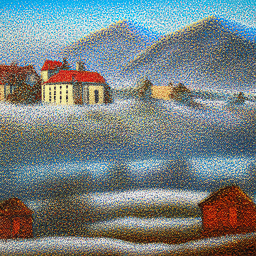
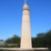
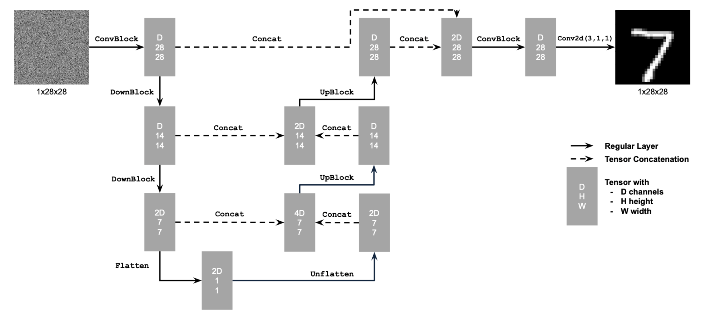

# Project 5: Fun With Diffusion Models!

# Part A: The Power of Diffusion Models

### Displaying Precomputed Text Embeddings

In this project, I used a DeepFloyd IF diffusion model, a two stage model trained as a text-to-image model, which takes text prompts as input and outputs images that are aligned with the text. To begin with, I instantiated DeepFloyd's stage_1 and stage_2 objects used for generation, as well as several text prompts for sample generation, which were the following: "An oil painting of a snowy mountain village," " A man wearing a hat," and "A rocket ship". I used random seed 1213, and tried different combinations of *num_inference_steps* for both stages to generate various versions of images for the same three prompts. Here are the results:

stage 1 *num_inference_steps* = 20, stage 2 *num_inference_steps* = 20

| Oil Painting of Snowy Mountain Village | Man Wearing a Hat| Rocket Ship | 
|:-------------------------:|:-------------------------:|:-------------------------:|
| |   |  |

stage 1 *num_inference_steps* = 40, stage 2 *num_inference_steps* = 50

| |   |  |

stage 1 *num_inference_steps* = 5, stage 2 *num_inference_steps* = 5
  
| |   |  |

stage 1 *num_inference_steps* = 10, stage 2 *num_inference_steps* = 10
  
| |   |  |

Thoughts:

I ran the three text prompts, 'an oil painting of a snowy mountain village', 'a man wearing a hat', and 'a rocket ship' with 4 iterations of different num_inference_steps. The first iteration was with num_inference_steps 20 for both Stage 1 and Stage 2, which produced images that were not very realistic and more "cartoon-like", other than the man in the hat, which was somewhat realistic but almost a bit too soft (painting-like). The second iteration was produced with 40 num_inference_steps for Stage 1 and 50 num_inference_steps for Stage 2, which led to a more realistic representation of the three prompts, which were all very well-made, especially the man in the hat -- I found this one to be the most realistic of them all. For my third iteration, I tried 5 num_inference_steps for both Stage 1 and Stage 2, which led to pretty faulty pictures. The oil painting of the snowy mountain village and the rocket ship were both splotchy and had a fair bit of noise, and the man wearing a hat turned out completely faulty, almost as if there were incomplete inference steps made towards the final image. For my last iteration, I used 10 num_inference_steps for Stage 1 and Stage 2, which resulted in 3 good pictures of the prompts. All 3 of the pictures were less cartoon-like than the first two iterations, and were fairly solid representations.

## Part 1: Sampling Loops 

In this section, I aim to write my own sampling loops, using the pretrained DeepFloyd denoisers, to implement tasks such as producing optical illusions or inpainting images. The sampling loop essentially performs reverse diffusion, aiming to start from pure noise, and use the denoiser to remove noise, and produce a clean image after T timesteps.

## 1.1: Implementing the Forward Process

I first implemented the forward process of diffusion: taking a clean image and adding noise to it, as well as scaling it appropriately. 

I implemented the noisy_im = forward(im, t) function, which adds noise to an image that corresponds to that given timstep t. Shown below are the results of the forward function on an image of the campanile, at noise time steps [250, 500, 750], which progressively add more noise to the image.

| Original Campanile Image | Noise Timestep 250 | Noise Timestep 500 | Noise Timestep 750 |
|:-------------------------:|:-------------------------:|:-------------------------:|:-------------------------:|
| |   |  |  |

## 1.2: Classical Denoising

We can try to use Gaussian blurring to denoise the noisy images, but as we can see, the results do not perform well at denoising the image and recovering the original photo.

| Noisy Image at Timestep 250 | Noisy Image at Timestep 500 | Noisy Image at Timestep 750 |
|:-------------------------:|:-------------------------:|:-------------------------:|
| |   |  | 

| Blurred Noise Timestep 250 | Blurred Noise Timestep 500 | Blurred Noise Timestep 750 |
|:-------------------------:|:-------------------------:|:-------------------------:|
| |   |  | 

### 1.3: One-Step Denoising

To attempt to denoise the image, I used a pretrained diffusion model called UNet (which was trained on large datasets of clean & noisy pairs of images), which predicts the Gaussian noise added to an image. Using this Gaussian noise, I then subtracted it from the image to obtain an estimate of the original image (after scaling the noise to the size of the image appropriately).

Shown below are the noisy images at timesteps 250, 500, and 750, and the corresponding one-step denoised images using UNet. 

| Noisy Image at Timestep 250 | Noisy Image at Timestep 500 | Noisy Image at Timestep 750 |
|:-------------------------:|:-------------------------:|:-------------------------:|
| |   |  | 

| One-Step Denoised Image at Timestep 250 | One-Step Denoised Image at Timestep 500 | One-Step Denoised Image at Timestep 750 |
|:-------------------------:|:-------------------------:|:-------------------------:|
| |   |  | 

At higher timesteps, due to more noise, the diffusion model struggles more to accurately estimate the noise added, and thus the estimated original image progressively gets less accurate.

## 1.4: Iterative Denoising

Instead of one-step denoising, iterative denoising is a much more accurate way to accurately estimate and remove the noise to obtain a clean image. Instead of iterating by one timestep, which can become inefficient, we can use strided timesteps and still obtain accurate results due to https://yang-song.net/blog/2021/score/. I created strided_timesteps, 
and then implemented the function iterative_denoise(image, i_start), which 

| Noisy Campanile at Timestep 690 | Noisy Campanile at Timestep 540 | Noisy Campanile at Timestep 390 |
|:-------------------------:|:-------------------------:|:-------------------------:|
| |   |  | 

| Noisy Campanile at Timestep 240 | Noisy Campanile at Timestep 90 | Original Campanile Image |
|:-------------------------:|:-------------------------:|:-------------------------:|
| |   |  | 

| Iteratively Denoised Campanile | One-Step Denoised Campanile | Gaussian Blurred Campanile |
|:-------------------------:|:-------------------------:|:-------------------------:|
| |   |  | 

As we can see, the iteratively denoised and one-step denoised campanile perform much better than the Gaussian-blurred campanile, and the iteratively denoised image more accurately captures details of the campanile than the one-step denoised, albeit not perfectly.

## 1.5: Diffusion Model Sampling

By using the function I made in the previous part, iterative_denoise(image, i_start), and setting i_start to 0 and passing random noise into the image, we can generate completely new images from scratch. Below are 5 results of a "high quality photo", generated using these steps.

           

## 1.6: Classifier-Free Guidance (CFG)

We were able to create 5 new images from scratch, but we can create even better quality photos using classifier-free guidance, which reduces hallucination by incorporating both an unconditional and conditional noise estimate. By running the UNet model twice—once with a conditional prompt and once with an empty prompt for the unconditional estimate — I blended the estimates using the formula *noise = noise_uncond + guidance_scale * (noise_cond - noise_uncond)*. For the unconditional generation, I used "a high quality photo" as the prompt to guide the image synthesis process, ensuring that the resulting images are of high quality compared to those generated without CFG. The images produced using this method showed improvements in clarity and detail compared to just diffusion model sampling from the previous part.
Below are 5 results from using CFG!

           

## 1.7: Image-to-Image Translation

I applied the Classifier-Free Guidance (CFG) technique from the previous part to edit existing images (rather than creating completely new ones from scratch) by adding noise and then denoising them, leveraging the model's capacity to introduce creative changes. This process, aligned with the SDEdit algorithm, involves noising the original image slightly and then using the iterative_denoise_cfg function to iteratively denoise it, aiming to make subtle edits by forcing the noisy image back onto the natural image manifold. I ran this denoising process at noise levels [1, 3, 5, 7, 10, 20], each reflecting increasing similarity to the original image. The results, labeled by their starting indices, demonstrate a progression of edits, showcasing how the image gradually approximates its original form. Here are three examples of this image-to-image translation, where I used the text prompt "a high quality photo", and fed in a different image every time. The larger the i_start, the more the result resembles the input image.

Example 1: Campanile as Input Image

| SDEdit, i_start = 1 | SDEdit, i_start = 3| SDEdit, i_start = 5 | SDEdit, i_start = 7 | SDEdit, i_start = 10 | SDEdit, i_start = 20 | Original Campanile |
|:-------------------------:|:-------------------------:|:-------------------------:|:-------------------------:|:-------------------------:|:-------------------------:|:-------------------------:|
| |   |  |  |  |  |  | 

Example 2: Autumn City as Input Image

| SDEdit, i_start = 1 | SDEdit, i_start = 3| SDEdit, i_start = 5 | SDEdit, i_start = 7 | SDEdit, i_start = 10 | SDEdit, i_start = 20 | Original Autumn City |
|:-------------------------:|:-------------------------:|:-------------------------:|:-------------------------:|:-------------------------:|:-------------------------:|:-------------------------:|
| |   |  |  |  |  |  | 

Example 3: Lantern as Input Image

| SDEdit, i_start = 1 | SDEdit, i_start = 3| SDEdit, i_start = 5 | SDEdit, i_start = 7 | SDEdit, i_start = 10 | SDEdit, i_start = 20 | Original Lantern |
|:-------------------------:|:-------------------------:|:-------------------------:|:-------------------------:|:-------------------------:|:-------------------------:|:-------------------------:|
| |   |  |  |  |  |  | 

## 1.7.1: Editing Hand-Drawn and Web Images

Here are the examples of using this image-to-image translation on three examples of non-realistic images, one of which is an image I took from the web (cartoon image of a bee), and a poor attempt at a cartoon flower and cartoon colorful person.

With lower i_start, the resulting images are not great at creating results that look like the original image, but as i_start gets bigger, the resulting image becomes more representatitve of the original image. Looking specifically at Example 3, the flower example wasn't really great but that could be due to the fact that the hand-drawn image I drew wasn't that great. It's still interesting to see the progression of the image looking more like the input image based on more initial information (larger i_start).

Example 1: **Web Image** of a Bee!

| SDEdit, i_start = 1 | SDEdit, i_start = 3| SDEdit, i_start = 5 | SDEdit, i_start = 7 | SDEdit, i_start = 10 | SDEdit, i_start = 20 | Original Bee |
|:-------------------------:|:-------------------------:|:-------------------------:|:-------------------------:|:-------------------------:|:-------------------------:|:-------------------------:|
| |   |  |  |  |  |  | 

Example 2: **Hand-Drawn Image** of a Colorful Person!

| SDEdit, i_start = 1 | SDEdit, i_start = 3| SDEdit, i_start = 5 | SDEdit, i_start = 7 | SDEdit, i_start = 10 | SDEdit, i_start = 20 | Original Person |
|:-------------------------:|:-------------------------:|:-------------------------:|:-------------------------:|:-------------------------:|:-------------------------:|:-------------------------:|
| |   |  |  |  |  |  | 

Example 3: **Hand-Drawn Image** of a Flower!

| SDEdit, i_start = 1 | SDEdit, i_start = 3| SDEdit, i_start = 5 | SDEdit, i_start = 7 | SDEdit, i_start = 10 | SDEdit, i_start = 20 | Original Flower |
|:-------------------------:|:-------------------------:|:-------------------------:|:-------------------------:|:-------------------------:|:-------------------------:|:-------------------------:|
| |   |  |  |  |  |  | 

## 1.7.2: Inpainting

We can use this same logic, but now inpaint a certain part of the image and keep the rest of the image intact.

Example 1: Inpainting the Top of the Campanile

| Campanile | Mask | Area to Replace | Inpainted Campanile |
|:-------------------------:|:-------------------------:|:-------------------------:|:-------------------------:|
| |   |  |  | 

Example 2: Inpainting the Eiffel Tower

| Eiffel Tower | Mask | Area to Replace | Inpainted Eiffel Tower |
|:-------------------------:|:-------------------------:|:-------------------------:|:-------------------------:|
| |   |  |  | 
 
Example 3: Inpainting a House in the Mountains

| House in the Mountains | Mask | Area to Replace | Inpainted House in the Mountains |
|:-------------------------:|:-------------------------:|:-------------------------:|:-------------------------:|
| |   |  |  | 

## 1.7.3: Text-Conditional Image-to-image Translation

We can include a prompt and an input image to give us more control over the images we are generated. Wth larger noise levels, the resulting image starts to look more and more like the original image.

Example 1: Prompted with "A Rocket Ship" on Campanile Image

| Rocket Ship, Noise Level 1 | Rocket Ship, Noise Level 3 | Rocket Ship, Noise Level 5 | Rocket Ship, Noise Level 7 | Rocket Ship, Noise Level 10 | Rocket Ship, Noise Level 20 | Original Campanile |
|:-------------------------:|:-------------------------:|:-------------------------:|:-------------------------:|:-------------------------:|:-------------------------:|:-------------------------:|
| |   |  |  |  |  |  |

Example 2: Prompted with "A Photo of a Dog" on Image of House on the Mountains

| Dog, Noise Level 1 | Dog, Noise Level 3 | Dog, Noise Level 5 | Dog, Noise Level 7 | Dog, Noise Level 10 | Dog, Noise Level 20 | Original House on the Mountains |
|:-------------------------:|:-------------------------:|:-------------------------:|:-------------------------:|:-------------------------:|:-------------------------:|:-------------------------:|
| |   |  |  |  |  |  |

Example 3: Prompted with "A Photo of the Amalfi Coast" on Image of New York City!

| Amalfi Coast, Noise Level 1 | Amalfi Coast, Noise Level 3 | Amalfi Coast, Noise Level 5 | Amalfi Coast, Noise Level 7 | Amalfi Coast, Noise Level 10 | Amalfi Coast, Noise Level 20 | Original NYC Image |
|:-------------------------:|:-------------------------:|:-------------------------:|:-------------------------:|:-------------------------:|:-------------------------:|:-------------------------:|
| |   |  |  |  |  |  |

## 1.8: Visual Anagrams

In this section, I implemented the Visual Anagrams task using a pretrained diffusion model (UNet) to create optical illusions that display different images depending on their orientation. The process involves denoising a noisy image twice: first with a prompt (e.g., "an oil painting of people around a campfire") to predict noise, and second after flipping  upside-down with a different prompt (e.g., "an oil painting of an old man") to predict noise. After flipping the image back to match the original orientation, the two noise estimates are averaged to produce the final noise, which is then used to denoise.

Shown below are the visual anagrams I created. I show the same image side by side, flipping one of them to show a different prompt!

| Oil Painting of an Old Man | Oil Painting of People Around a Campfire | 
|:-------------------------:|:-------------------------:|
| |   |

| Photo of Amalfi Coast | Photo of Dog | 
|:-------------------------:|:-------------------------:|
| |   |

| Photo of Pencil | Photo of Rocket Ship | 
|:-------------------------:|:-------------------------:|
| |   |

## 1.9 Hybrid Images

In this section, I made "hybrid images" using a diffusion model and the concept of Factorized Diffusion, where up close, an image looks like a certain prompt, and far away, it looks like a different prompt. This involves creating a composite noise estimate 𝜖 by combining the low frequencies of one noise estimate with the high frequencies of another. To achieve this, I used two separate text prompts to denoise the same noisy image, followed by applying a low-pass filter to the first noise and a high-pass filter to the second noise. The final noise estimate is the sum of the filtered components.

Using this method, I generated hybrid images that exhibit different visual features depending on the viewer's distance. For example, in the first result, the image is a "skull" from afar but transforms into waterfalls up close.

**Example 1: Skull + Waterfalls**

Low-pass: 'a lithograph of a skull'

High-pass: 'a lithograph of waterfalls'

 

**Example 2: Mountains + Barista**

Low-pass: 'an oil painting of a snowy mountain village'

High-pass: 'a photo of a hipster barista'

 

**Example 3: Dog + Amalfi Coast**

Low-pass: 'a photo of the amalfi coast'

High-pass: 'a photo of a dog'

 

#  Part B: Diffusion Models from Scratch!

In this part of the project, I worked on training a diffusion model from scratch on the MNIST dataset.

# Part 1: Training a Single-Step Denoising UNet

## 1.1: Implementing the UNet

I started by building a simple one-step denoiser, which I implemented as a UNet. This is the model architecture that I followed, as given on the class website.

 

## 1.2: Using the UNet to Train a Denoiser

### 1.2.1: Training

In this section, I trained a UNet-based denoiser to map noisy images z to clean images x, using an L2 loss. The noisy images were generated by adding Gaussian noise to clean MNIST digits, scaled by a noise level 𝜎. Here is the visualization of the noising process for various 
𝜎 values [0.0, 0.2, 0.4, 0.5, 0.6, 0.8, 1.0], showing progressively noisier images.

 

I then trained the UNet model to denoise noisy images z generated by adding Gaussian noise (with noise level = 0.5 to clean MNIST digits. The model was trained on the MNIST training dataset for 5 epochs with a batch size of 256, using the Adam optimizer. A new noisy version of the dataset was created for each batch to improve generalization. The figure below shows the training loss curve, which demonstrates a that the loss steadily decreased over time as the model converged.

 

Here is the input, output, and denoised results (of random images selected from the test set) during training on the 1st and 5th epoch.

Results after the 1st epoch:

 

Results after the 5th epoch:

 

### 1.2.2: Out-of-Distribution Testing

I trained the denoiser on noisy images with noise_level 0.5, but we can visualize the results on test set digits for various 
𝜎 values [0.0, 0.2, 0.4, 0.5, 0.6, 0.8, 1.0].

As you can see, the denoised outputs get less effective (more artifacts) as the noise level increases.

 

## Part 2: Training a Diffusion Model

Like we learned in the previous part of this project, iterative denoising works much more effectively than one-step denoising. In order to do this, I implemented a Denoising Diffusion Probabilistic Model (DDPM) to iteratively denoise noisy images. Unlike single-step denoising, DDPM uses a timestep t to condition the model, allowing it to handle varying levels of noise. The noise is progressively reduced at each step using a predefined variance schedule and its cumulative product. I trained on the model was trained using a simplified schedule of 300 timesteps, optimizing an L2 loss between predicted and actual noise at each step, which improves the denoising results.

### 2.1: Adding Time Conditioning to UNet

To add time conditioning, I slightly adjusted the current UNet architecture, adding 2 FCBlocks positioned like such.

 

### 2.2 Training the UNet

In order to train the UNet, I followed this algorithm:

 

These were the results for the training losses, which show a successive decrease in loss after training iterations.

 

### 2.3: Sampling from the UNet

To sample from the UNet, I implemented this algorithm, resulting in the following results from Epoch 5 and Epoch 20 shown below.

Sampling algorithm for Time-Conditioned UNet:

 

Results after Epoch 5:

 

Results after Epoch 20:

As we can see, the results improve with successive epochs, and compared to the previous part (without iterative denoising), the results look a lot better after adding time conditioning and iterative denoising, 

### 2.4: Adding Class-Conditioning to UNet

To even further improve the results of the UNet on denoising MNIST images, we can also condition our UNet on the class of the digit 0-9. In order to do this, I added 2 new FCBlocks to the architecture, so that it followed as such. But in order to give the UNet more flexibility and ensure it works without conditioning on class, I made class-conditioning-vector c one-hot-encoded as c_one_hot, and dropped c_one_hot to zero 10% of the time.

Here were the results for the training losses:

 

### 2.5: Sampling from the Class-Conditioned UNet

To sample from the UNet, I implemented the algorithm shown below, resulting in the following results from Epoch 1, 5, 10, and 20.

Sampling algorithm for Class-Conditioned UNet:

 

Results after Epoch 1:

 

Results after Epoch 5:

 

Results after Epoch 10:

 

Results after Epoch 20:

As we can see, the class-conditioned UNet improves with successive epochs, and implementing classifier free guidance allows the UNet to produce digits that look slightly different from the MNIST dataset. The results do get thicker and smoother with more and more epochs, and by Epoch 20, the results are maybe a bit too thick.

## Reflections

Overall, this project was really fun, interactive, and challenging! I learned a lot about diffusion models and generative models. Very cool stuff!

